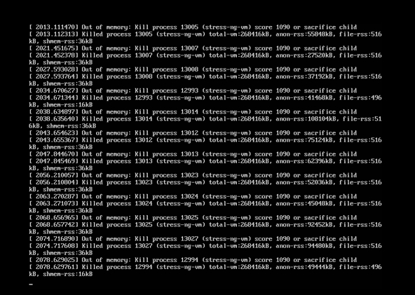

# 内存不足：OOM



OOM 即 Out Of Memory，“内存用完了”,在情况在java程序中比较常见。系统会选一个进程将之杀死， 在日志messages中看到类似下面的提示
```
Jul 10 10:20:30 kernel: Out of memory: Kill process 9527 (java) score 88 or sacrifice child
```

当JVM因为没有足够的内存来为对象分配空间并且垃圾回收器也已经没有空间可回收时，就会抛出这个error，因为这个问题已经严重到不足以被应用处理）。

**原因：**
- 给应用分配内存太少：比如虚拟机本身可使用的内存（一般通过启动时的VM参数指定）太少。
- 应用用的太多，并且用完没释放，浪费了。此时就会造成内存泄露或者内存溢出。

**使用的解决办法：**

1，限制java进程的max heap，并且降低java程序的worker数量，从而降低内存使用2，给系统增加swap空间

设置内核参数（不推荐），不允许内存申请过量：
```
echo 2 > /proc/sys/vm/overcommit_memory 
echo 80 > /proc/sys/vm/overcommit_ratio 
echo 2 > /proc/sys/vm/panic_on_oom
```

说明：
- Linux默认是允许memory overcommit的，只要你来申请内存我就给你，寄希望于进程实际上用不到那么多内存，但万一用到那么多了呢？Linux设计了一个OOM killer机制挑选一个进程出来杀死，以腾出部分内存，如果还不够就继续。也可通过设置内核参数 vm.panic_on_oom 使得发生OOM时自动重启系统。这都是有风险的机制，重启有可能造成业务中断，杀死进程也有可能导致业务中断。所以
- Linux 2.6之后允许通过内核参数 vm.overcommit_memory 禁止memory overcommit。

**vm.panic_on_oom 决定系统出现oom的时候，要做的操作。接受的三种取值如下：**
```
0  - 默认值，当出现oom的时候，触发oom killer
1  - 程序在有cpuset、memory policy、memcg的约束情况下的OOM，可以考虑不panic，而是启动OOM killer。其它情况触发 kernel panic，即系统直接重启
2  - 当出现oom，直接触发kernel panic，即系统直接重启
```

**vm.overcommit_memory 接受三种取值:**
```
0  – Heuristic overcommit handling. 这是缺省值，它允许overcommit，但过于明目张胆的overcommit会被拒绝，比如malloc一次性申请的内存大小就超过了系统总内存。Heuristic的意思是“试  探式的”，内核利用某种算法猜测你的内存申请是否合理，它认为不合理就会拒绝overcommit。
1  – Always overcommit. 允许overcommit，对内存申请来者不拒。内核执行无内存过量使用处理。使用这个设置会增大内存超载的可能性，但也可以增强大量使用内存任务的性能。
2  – Don’t overcommit. 禁止overcommit。 内存拒绝等于或者大于总可用 swap 大小以及overcommit_ratio 指定的物理 RAM 比例的内存请求。如果希望减小内存过度使用的风险，这个设置就是最好的。
```

**Heuristic overcommit算法：**

单次申请的内存大小不能超过以下值，否则本次申请就会失败。
```
free memory + free swap + pagecache的大小 + SLAB
```

vm.overcommit_memory=2 禁止overcommit,那么怎样才算是overcommit呢？

kernel设有一个阈值，申请的内存总数超过这个阈值就算overcommit，在/proc/meminfo中可以看到 这个阈值的大小：
```
[18:46:58 root@centos8 ~]#grep -i commit /proc/meminfo
CommitLimit:     2584584 kB
Committed_AS:     297536 kB
```

CommitLimit 就是overcommit的阈值，申请的内存总数超过CommitLimit的话就算是overcommit。此值通过内核参数vm.overcommit_ratio或vm.overcommit_kbytes间接设置的，公式如下：
```
CommitLimit = (Physical RAM * vm.overcommit_ratio / 100) + Swap
```

vm.overcommit_ratio 是内核参数，缺省值是50，表示物理内存的50%。如果你不想使用比率，也可以直接指定内存的字节数大小，通过另一个内核参数 vm.overcommit_kbytes 即可；

如果使用了huge pages，那么需要从物理内存中减去，公式变成：
```
CommitLimit = ([total RAM] – [total huge TLB RAM]) * vm.overcommit_ratio / 100 + swap
```

/proc/meminfo中的 Committed_AS 表示所有进程已经申请的内存总大小，（注意是已经申请的，不是已经分配的），如果 Committed_AS 超过 CommitLimit 就表示发生了 overcommit，超出越多表示overcommit 越严重。Committed_AS 的含义换一种说法就是，如果要绝对保证不发生OOM (out of memory) 需要多少物理内存。

范例：
```
[root@centos8 ~]#cat /proc/sys/vm/panic_on_oom 0
[root@centos8 ~]#cat /proc/sys/vm/overcommit_memory 0
[root@centos8 ~]#cat /proc/sys/vm/overcommit_ratio 50
[root@centos8 ~]#grep -i commit /proc/meminfo
CommitLimit:    3021876 kB
Committed_AS:     340468 kB
```

**临时防止某个进程被OOM**

防止重要的系统进程触发(OOM)机制而被杀死：可以设置参数/proc/PID/oom_adj为-17，可临时关闭linux内核的OOM机制。内核会通过特定的算法给每个进程计算一个分数来决定杀哪个进程，每个进程的oom分数可以/proc/PID/oom_score中找到。我们运维过程中保护的一般是sshd和一些管理agent。

至于为什么用-17而不用其他数值（默认值为0），这个是由linux内核定义的，查看内核源码可知：

以linux-3.3.6版本的kernel源码为例，路径为linux-3.6.6/include/linux/oom.h，阅读内核源码可知oom_adj的可调值为15到-16，其中15最大-16最小，-17为禁止使用OOM。oom_score为2的n次方计算出来的，其中n就是进程的oom_adj值，所以oom_score的分数越高就越会被内核优先杀掉
```
echo -17 > /proc/$PID/oom_adj
```
